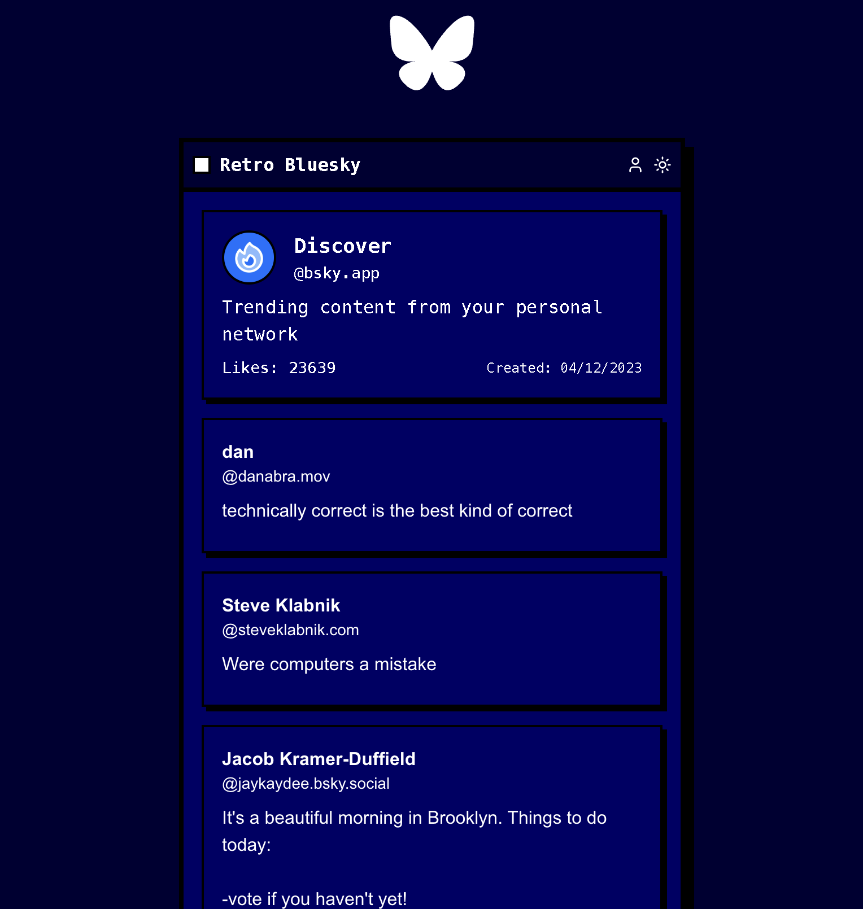

# Retro Bluesky

A retro-styled Bluesky social feed viewer with a nostalgic interface. This application provides a unique way to view Bluesky's "What's Hot" feed with a retro computer aesthetic.





## Features

- Retro-styled UI with custom RetroTopaz font
- Dark/Light mode toggle
- Real-time feed updates
- Responsive design
- Docker support
- Caching system for API requests

## Tech Stack

- Next.js 14
- TypeScript
- Tailwind CSS
- @atproto/api for Bluesky integration
- Docker

## Prerequisites

- Node.js 20 or higher
- npm or yarn
- A Bluesky account

## Getting Started

1. Clone the repository:
```bash
git clone https://github.com/bjarneo/retro-bluesky.git
cd retro-bluesky
```

2. Install dependencies:
```bash
npm install
```

3. Create a `.env.local` file in the root directory with the following content:
```bash
BLUESKY_USERNAME=your.handle.bsky.social
BLUESKY_PASSWORD=your-app-password
```

Note: You'll need to generate an app-specific password from your Bluesky account settings.

4. Run the development server:
```bash
npm run dev
```

5. Open [http://localhost:3000](http://localhost:3000) in your browser.

## Docker Deployment

To run the application using Docker:

```bash
# Build the image
docker build -t retro-bluesky .

# Run the container
docker run -p 3000:3000 --env-file .env.local retro-bluesky
```

## Project Structure

The project follows a standard Next.js 14 structure with the following key directories:

- `/app`: Main application components and pages
- `/components`: Reusable UI components
- `/lib`: Utility functions and API client
- `/public`: Static assets

## Environment Variables

Create a `.env.local` file with the following variables:

```env
# Bluesky Authentication
BLUESKY_USERNAME=your.handle.bsky.social
BLUESKY_PASSWORD=your-app-password
```

## Contributing

Contributions are welcome! Please feel free to submit a Pull Request.

## License

MIT License

## Credits

Created by [dothash](https://dothash.win)
